  <picture>
    <source media="(prefers-color-scheme: dark)" srcset="./assets/header-dark.svg">
    <source media="(prefers-color-scheme: light)" srcset="./assets/header-light.svg">
    
  </picture>

### About

Software engineer focused on systems that connect **web interfaces, desktop applications, backend services and physical devices**. I care about clear workflows, offline resilience and software that stays useful outside the perfect demo environment.

### Stack

<table>
  <tr>
    <td width="25%" valign="top">
      <strong>Interface</strong>  
      
      &nbsp;
      
      &nbsp;
      
      &nbsp;
      
        
      TypeScript · React Vite · Tailwind
    </td>
    <td width="25%" valign="top">
      <strong>Runtime</strong>  
      
      &nbsp;
      
      &nbsp;
      
      &nbsp;
      
        
      Node.js · Electron Express · Socket.IO
    </td>
    <td width="25%" valign="top">
      <strong>Data</strong>  
      
      &nbsp;
      
      &nbsp;
      
      &nbsp;
      
        
      MySQL · SQLite PostgreSQL · Redis
    </td>
    <td width="25%" valign="top">
      <strong>Systems</strong>  
      
      &nbsp;
      
      &nbsp;
      
      &nbsp;
      
        
      Linux · Docker Cloudflare · Git
    </td>
  </tr>
</table>

### What I’m good at

- Building **local-first and offline-capable** application flows.
- Connecting **software, realtime events and physical hardware**.
- Turning operational complexity into **clear, compact interfaces**.

  Web · Desktop · Mobile · Backend · Infrastructure

